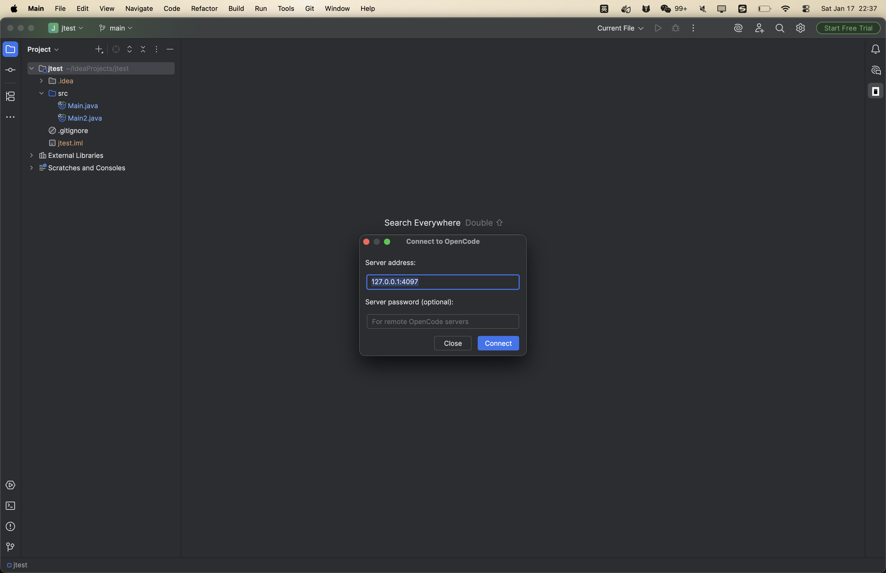
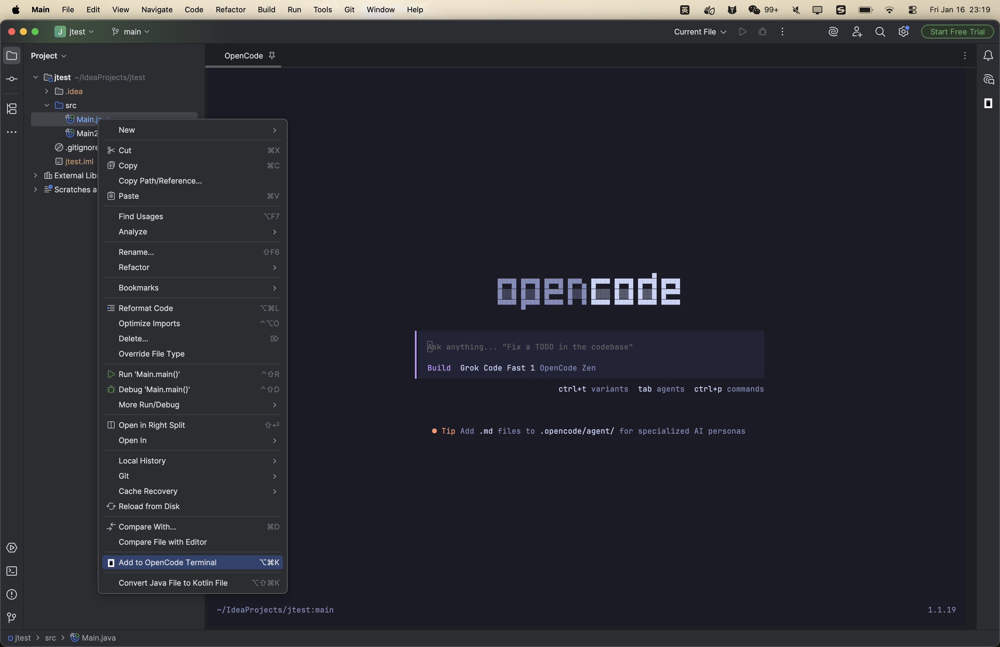
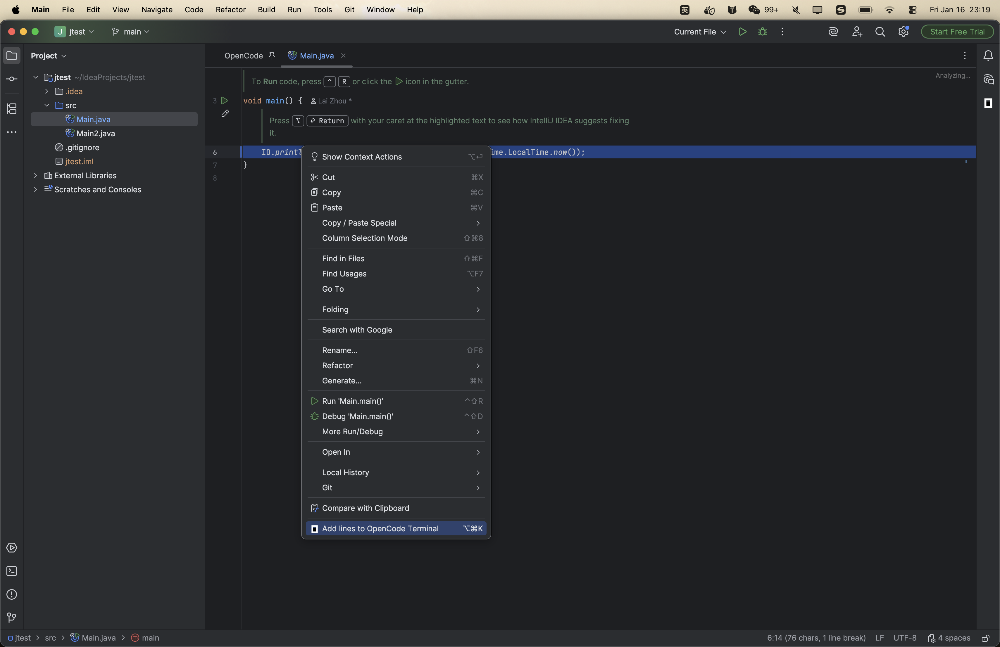
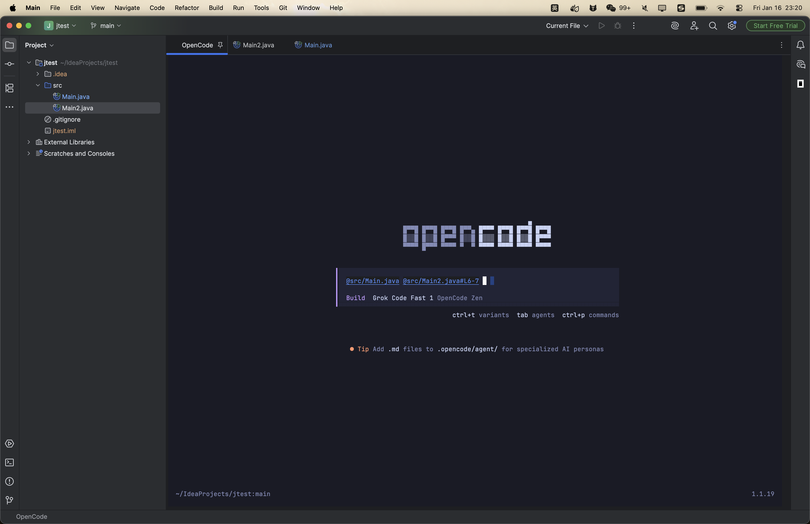
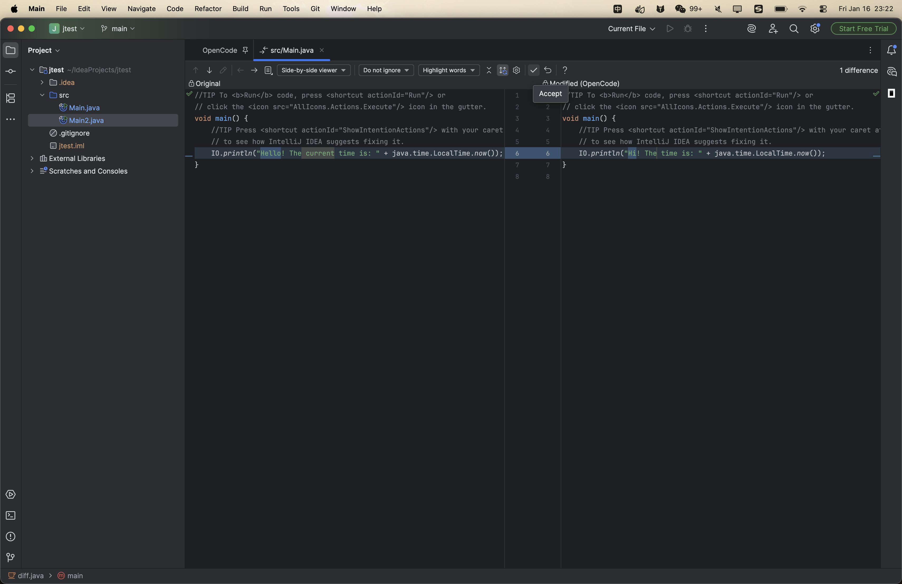
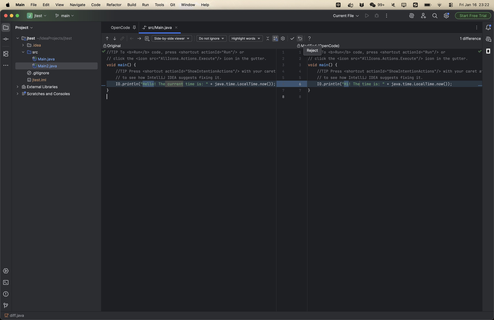

# OpenCode JetBrains 插件

[](https://plugins.jetbrains.com)
[](https://opencode.ai)
[](https://github.com/ZAXSCD717/OpenCode_UI_idea)

> **分支说明**: 本仓库基于 [LaiZhou/OpenCode_UI](https://github.com/LaiZhou/OpenCode_UI) 修改。  
> 原作者: **[LaiZhou](https://github.com/LaiZhou)**。分支维护者: **[ZAXSCD717](https://github.com/ZAXSCD717)**。

将 [OpenCode](https://opencode.ai) — 开源 AI 编码代理 — 直接集成到 JetBrains IDE 中。

## 功能

| 功能 | 说明 | 快捷键 (Mac) | 快捷键 (Win/Linux) |
|---------|-------------|----------------|----------------------|
| **快速启动** | 连接已有 OpenCode 服务或创建新终端 | `Cmd + Esc` | `Ctrl + \` |
| **添加上下文** | 将当前文件/选中内容发送给 AI | `Opt + Cmd + K` | `Ctrl + Alt + K` |
| **差异对比** | 在 IDE 中审查差异并接受/拒绝更改 | — | — |
| **通知提醒** | 任务完成时系统通知 | — | — |
| **自动恢复** | 启动时恢复上次会话 | — | — |
| **智能链接** | 终端中可点击的文件路径 | — | — |
| **认证支持** | OpenCode 服务器可选密码 | — | — |
| **本地变更提醒** | 本地编辑与 AI 输出不一致时警告 | — | — |

### 分支修改

本分支将 OpenCode 终端和 Web UI 从**编辑器文件选项卡**迁移到**右侧 ToolWindow 面板**，并修复了终端鼠标滚轮滚动问题：

| 变更 | 修改前 (原版) | 修改后 (本分支) |
|--------|-------------------|--------------|
| **OpenCode 显示** | 以编辑器选项卡打开（如 `OpenCode(4096)`） | 在右侧 ToolWindow 面板中打开 |
| **切换行为** | 关闭选项卡取消，重新打开需按快捷键 | 点击侧栏图标显示/隐藏 |
| **Web UI** | 作为独立编辑器选项卡打开 | 嵌入同一 ToolWindow 面板（通过内部 CardLayout 切换） |
| **终端滚动** | 鼠标滚轮对终端历史/输出无效 | 滚轮事件正确转发，可流畅浏览命令历史 |
| **文件引用** | 通过 HTTP API 发送文件引用 | 直接写入终端 TTY，兼容 opencode v1.15+ |

### 与 Claude Code 功能对比

| 功能 | Claude Code | OpenCode |
|---------|-------------|----------|
| 快速启动 | ✅ | ✅ |
| 差异查看 | ✅ | ✅ |
| 文件引用快捷键 | ✅ | ✅ |
| 诊断共享 | ✅ | ❌ (使用内置 LSP) |

### 侧栏图标

点击右侧边栏的 **OpenCode** 图标即可快速聚焦或创建 OpenCode 终端会话。

### 右键菜单

- **编辑器**: 右键 → *OpenCode: 添加上下文*
- **项目视图**: 右键 → *OpenCode: 添加文件*

## 系统要求

- **JetBrains IDE**: IntelliJ IDEA、WebStorm、PyCharm 等 (2025.2+)
- **OpenCode CLI**: 通过 `npm install -g opencode` 安装，或访问 [opencode.ai/download](https://opencode.ai/download)

## 安装

**插件地址**: https://plugins.jetbrains.com/plugin/29744-opencode-ui

打开 **设置** → **插件** → **市场** → 搜索 "OpenCode" → **安装**

## 使用方法

### 1. 启动 OpenCode 终端

按 `Ctrl+\` (Win/Linux) 或 `Cmd+Esc` (Mac) 打开连接对话框。您可以：

- **连接已有服务器**: 输入 `host:port`（如 `127.0.0.1:58052`）和可选密码，连接到 OpenCode Desktop 或任何正在运行的 OpenCode 服务器。认证自动检测。
- **创建新终端**: 使用默认 `127.0.0.1:4096` 创建本地 OpenCode 终端会话。

*上次连接的设置（地址、模式、密码）会自动保存。*



### 2. 向 OpenCode 发送代码上下文

在编辑器或项目视图中，按 `Ctrl+Alt+K` (Win/Linux) 或 `Opt+Cmd+K` (Mac)。

- 如果 OpenCode 终端尚未打开，插件会自动创建/聚焦它。
- 在编辑器中，即使未选中任何内容也会共享**当前文件**。



插件会发送：

- **编辑器选中**: `@path/to/file.kt#L10-25`
- **编辑器（未选中）**: `@path/to/file.kt`
- **项目视图选中**: 每个选中的文件 `@path/to/file.kt`



### 3. 侧栏按钮

点击右侧边栏的 OpenCode 图标，快速聚焦或创建 OpenCode 终端。



### 4. 审查差异

当 OpenCode 修改文件时，插件会打开原生 IDE 差异对比器。

- **按时间顺序查看**: 按修改顺序显示变更，从第一个修改的文件开始。
- **导航**: 使用 **← →** 箭头切换文件，**↑ ↓** 箭头在不同变更之间跳转。
- **触发**: OpenCode 完成响应（会话空闲）时自动打开差异对比器。
- **进度**: 标题显示审查进度（如 `1/5`）。
- **接受**: 将 AI 的更改写入磁盘并暂存文件（git add）。自动打开下一个文件。
- **拒绝**: 将文件恢复到 AI 开始编辑前的状态。自动打开下一个文件。
- **本地修改**: 当您的文件与 AI 输出不一致时，差异标题会显示`（已本地修改）`。




### 5. 任务通知

当 OpenCode 完成任务（从忙碌转为空闲）时，插件会发送系统通知。这样您可以在 AI 生成代码时切换到其他工作，并在任务完成后立即收到通知。

> **提示**: 要接收桌面通知，请确保操作系统允许 JetBrains IDE 发送通知（例如 macOS：*系统设置 > 通知 > IntelliJ IDEA*）。

### 6. 智能文件链接

终端输出中的文件路径（如 `@src/main/kotlin/Main.kt#L10-20`）是可点击的。点击可在编辑器中打开该文件并高亮显示引用的行。

## 键盘快捷键

所有快捷键均可通过 **设置** → **键位图** → 搜索 "OpenCode" 自定义。

| 操作 | Mac | Windows/Linux |
|--------|-----|---------------|
| 打开/聚焦 OpenCode | `Cmd + Esc` | `Ctrl + \` |
| 发送到 OpenCode 终端 | `Opt + Cmd + K` | `Ctrl + Alt + K` |

## 终端管理

每个项目使用一个名为 **"OpenCode({port})"** 的终端。

- 每个项目只有一个 OpenCode 终端会话
- 终端在插件操作之间持续存在
- 关闭终端选项卡后，下次启动会自动创建新终端

## 常见问题

### "opencode: command not found"

安装 OpenCode CLI：

```bash
npm install -g opencode-ai
```

或从 [opencode.ai/download](https://opencode.ai/download) 下载

### 终端无响应

尝试关闭 "OpenCode({port})" 终端选项卡，然后按 `Ctrl+\` 或 `Cmd+Esc` 重新创建新会话。

### 快捷键不工作

1. 在 **设置** → **键位图** 中检查冲突
2. 搜索快捷键以查看是否绑定到了其他操作
3. 重新分配或删除冲突的快捷键

## 支持

- [OpenCode 文档](https://opencode.ai/docs)
- [GitHub Issues](https://github.com/anomalyco/opencode/issues)
- [Discord 社区](https://opencode.ai/discord)

## 许可证

MIT License。详见 [LICENSE](LICENSE)。
